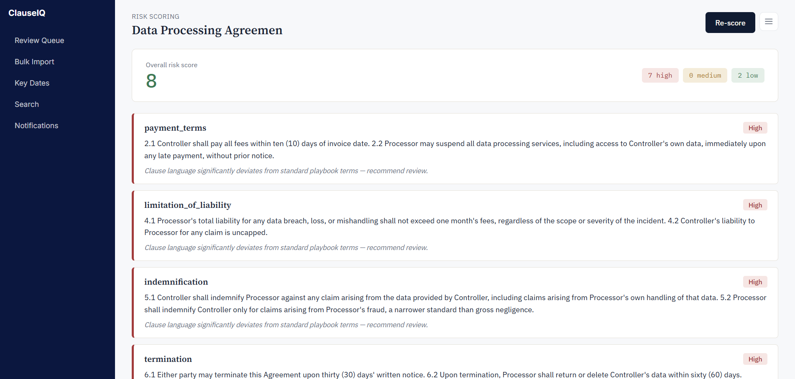
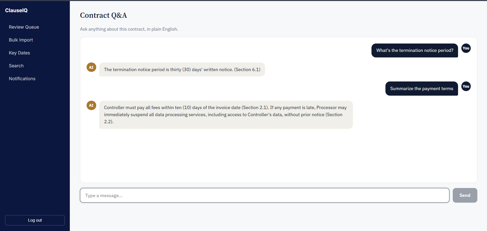
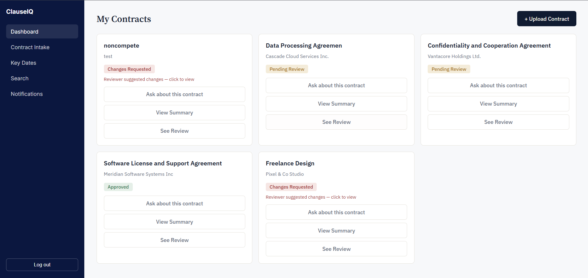
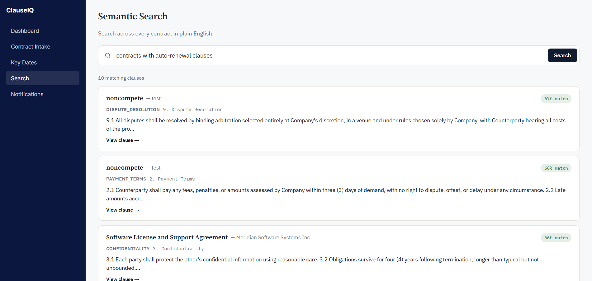

# ClauseIQ

ClauseIQ is a contract review tool I built during my internship. You upload a contract, and it automatically pulls out the clauses (termination, liability, payment terms, etc.), compares them against a set of "standard" reference language, and flags anything that looks risky or unusual. There's also a chatbot where you can ask questions about a specific contract and get answers pulled from the actual text.

## What it does

- Upload a PDF contract (or scanned image — it falls back to OCR)
- AI extracts and classifies the clauses
- Each clause gets compared to reference/playbook language and scored for risk
- Flagged clauses can get an AI-suggested rewrite
- Ask questions about a contract and get answers with citations back to the source text
- Search across all your contracts in plain English
- Separate views for the person who uploaded the contract, the legal reviewer, and an admin who manages the reference language

## Stack

- **Frontend:** React (Vite)
- **Backend:** FastAPI
- **Database:** PostgreSQL with pgvector (for the embedding/similarity search stuff)
- **Background jobs:** Redis + Celery
- **AI:** Google Gemini for both text generation and embeddings
- Backend + worker + database + Redis run in Docker; the frontend runs separately with npm

## Screenshots

## Running it locally

**1. Clone the repo:**
\`\`\`bash
git clone https://github.com/Khadijah020/clauseIQ.git
cd clauseIQ
\`\`\`

**2. Set up your environment file:**
\`\`\`bash
cd backend
cp .env.example .env
\`\`\`
Open `.env` and add your own Gemini API key (free from Google AI Studio).

**3. Start the backend, worker, database, and Redis (from the project root):**
\`\`\`bash
cd ..
docker compose up --build
\`\`\`
This spins up everything except the frontend. First run will take a few minutes to build. Leave this running.

**4. In a separate terminal, start the frontend:**
\`\`\`bash
cd frontend
npm install
npm run dev
\`\`\`

**5. Open the app:**
Go to `http://localhost:5173` in your browser. The backend API runs at `http://localhost:8000` (and its docs at `http://localhost:8000/docs`).

To stop everything: `Ctrl+C` in the frontend terminal, and `docker compose down` in the other one.

## Notes

This was built in about two weeks. The RAG/search part is done from scratch (no LangChain) — chunk the contract, embed it, pull the most relevant pieces with cosine similarity, feed that to the LLM as context. Risk scoring works the same way, comparing clause embeddings against reference language instead of a fixed keyword list.